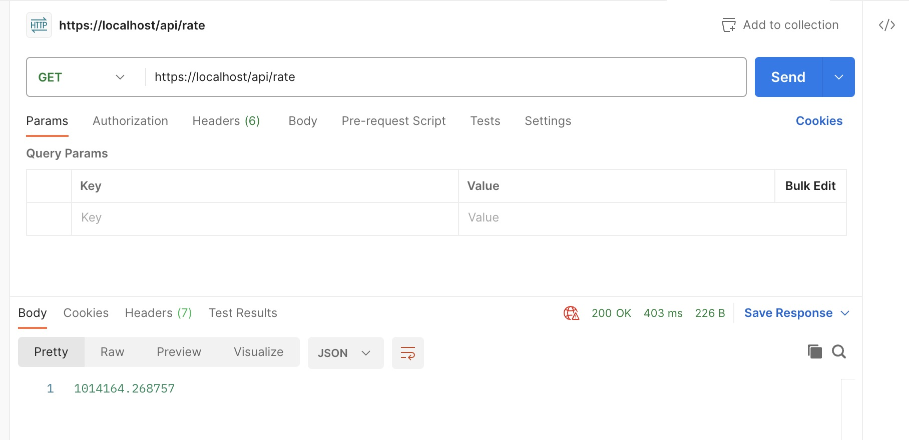
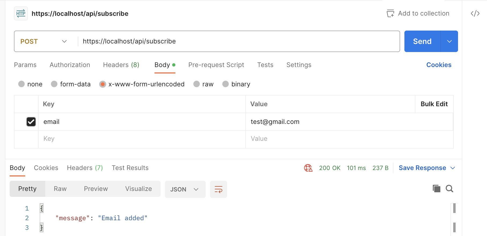
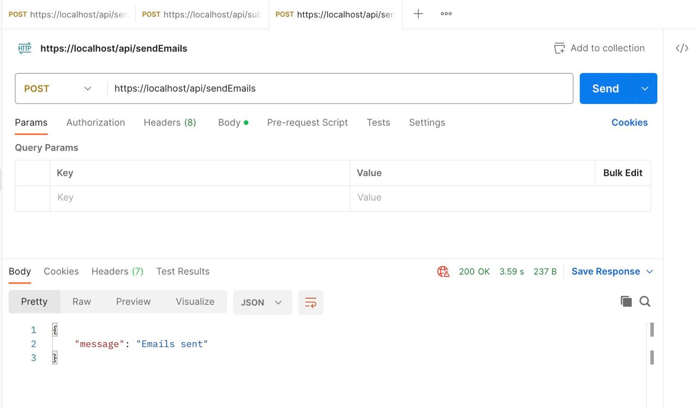
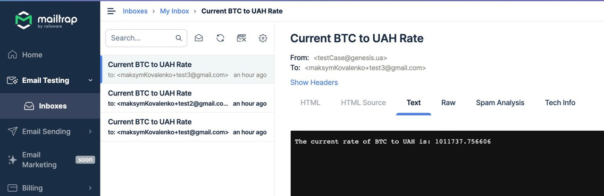

# Maksym Kovalenko Genesis SES 3.0 Test Case

## Getting Started

1. If not already done, [install Docker Compose](https://docs.docker.com/compose/install/) (v2.10+)
2. Run `docker compose build --pull --no-cache` to build fresh images
3. Run `docker compose up` (the logs will be displayed in the current shell)
4. Open `https://localhost` in your favorite web browser and [accept the auto-generated TLS certificate](https://stackoverflow.com/a/15076602/1352334)
5. Run `docker compose down --remove-orphans` to stop the Docker containers.

## API Endpoints
The Bitcoin to UAH Rate API exposes the following endpoints:

### Get Rate

URL: /api/rate

Method: GET

Description: Retrieve the current rate of BTC to UAH.

Response:

    Status 200: The current rate of BTC to UAH is returned in the response body.

    Status 400: If the rate is not available or invalid, an error message is returned.

This endpoint fetches the current BTC to UAH rate using the Coinlayer API. If the rate is available, it is returned in the response. Otherwise, an error message is returned.

#### API test with Postman

### Subscribe

URL: /api/subscribe

Method: POST

Description: Sign up for an email to receive the current rate.

Request Body:

email (required): Email address to be signed up.

Response:

    Status 200: The email is successfully added.

    Status 409: If the email is already in the database.

This endpoint allows users to sign up with their email address to receive the current rate of BTC to UAH. The email address is checked against the existing database to avoid duplicates. If the email is already in the database, a conflict error is returned.

#### API test with Postman

### Send Emails

URL: /api/sendEmails

Method: POST

Description: Send an email with the current rate to all subscribed emails.

Response:

    Status 200: The emails are successfully sent.

#### API test with Postman

    
#### Testing of emails sending done using MailTrap service

